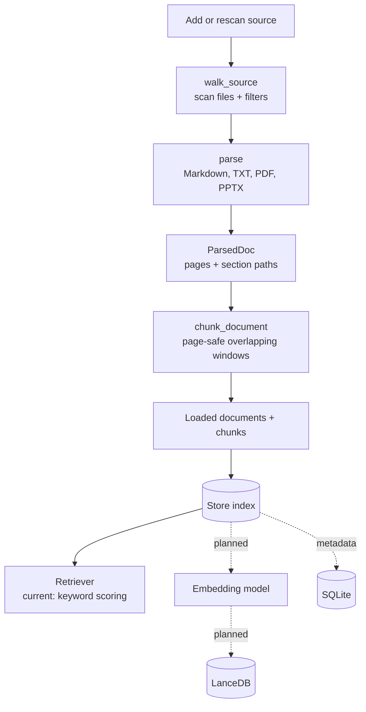
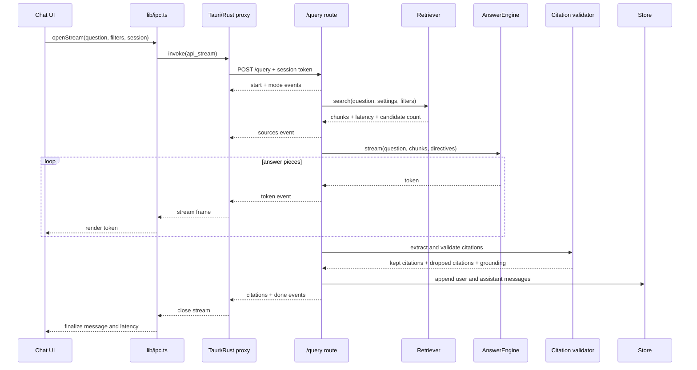

# Custom RAG architecture

These diagrams describe the current prototype as implemented in the repository.
Solid edges are active paths; dashed edges are planned or optional integrations.

## Runtime boundaries

```mermaid
flowchart LR
    user([User])

    subgraph desktop[Desktop app]
        ui[React + TypeScript UI\nfeatures and routes]
        queryCache[React Query cache]
        ipc[lib/ipc.ts\nAPI facade + SSE client]
        ui --> queryCache
        ui --> ipc
    end

    subgraph shell[Tauri shell]
        commands[Tauri commands]
        proxy[Rust HTTP/SSE proxy\nkeeps URL and token private]
        supervisor[Sidecar supervisor\nspawn, health, restart, shutdown]
        keychain[OS keychain\nconnection secrets]
        hardware[Hardware detection]
        commands --> proxy
        commands --> keychain
        commands --> hardware
        supervisor --> proxy
    end

    subgraph sidecar[Python sidecar: ragcore]
        fastapi[FastAPI app\nauthenticated localhost API]
        routes[API routes\nquery, chats, sources, documents, jobs,\nmodels, connections, settings, evals, conversions]
        backend[Backend composition\nports + adapters]
        fastapi --> routes --> backend
    end

    subgraph adapters[Backend adapters]
        store[StorePort]
        answerer[AnswerEngine]
        jobs[Job manager]
        hub[Model hub client]
        backend --> store
        backend --> answerer
        backend --> jobs
        backend --> hub
    end

    subgraph current[Current stub implementation]
        stubStore[In-memory Store]
        corpus[Fixture corpus loader]
        retriever[Keyword retriever]
        scripted[Scripted answer stream]
        llm[Optional OpenAI-compatible LLM]
        stubStore --> corpus --> retriever
        stubStore --> retriever
        scripted --> answerer
        llm --> answerer
    end

    subgraph planned[Persistent / local model path]
        sqlite[(SQLite metadata)]
        lance[(LanceDB vectors)]
        embedder[Local embedding server]
        reranker[Local reranker server]
    end

    user --> ui
    ipc -->|Tauri invoke| commands
    proxy -->|HTTP localhost + Bearer token| fastapi
    store --> stubStore
    answerer --> scripted
    answerer -. the connection the user activated .-> llm
    store -. future real adapter .-> sqlite
    store -. future real adapter .-> lance
    retriever -. dense / hybrid retrieval .-> embedder
    retriever -. reranking .-> reranker

    style desktop fill:#f8fafc,stroke:#64748b
    style shell fill:#f8fafc,stroke:#64748b
    style sidecar fill:#f8fafc,stroke:#64748b
    style adapters fill:#f8fafc,stroke:#64748b
    style current fill:#ecfdf5,stroke:#059669
    style planned fill:#fff7ed,stroke:#ea580c
```

## Ingestion flow

The current fixture store keeps the loaded corpus and retriever in memory. The
parsing, page numbering, chunk offsets, and citation boundaries are already
designed so the persistent backend can replace the adapter without changing the
API routes.

## Query and streaming flow

## Source map

| Area | Main implementation | Responsibility |
| --- | --- | --- |
| Desktop UI | `apps/desktop/src/features` | Product screens and user interactions |
| UI boundary | `apps/desktop/src/lib/ipc.ts` | Typed API facade; no direct sidecar access |
| Native shell | `apps/desktop/src-tauri/src` | Process supervision, proxying, hardware, keychain |
| HTTP contract | `core/ragcore/src/ragcore/api` | FastAPI app, routes, schemas, SSE framing |
| Backend seam | `core/ragcore/src/ragcore/ports.py` | Stable interfaces for store and answer engine |
| Current backend | `core/ragcore/src/ragcore/stub` | Fixture corpus, in-memory store, retrieval, scripted answers |
| Ingestion primitives | `core/ragcore/src/ragcore/ingest` | Walk, parse, page, chunk |
| Persistent primitives | `core/ragcore/src/ragcore/store` | SQLite metadata and LanceDB vector storage |
| Test corpus | `fixtures/docs` | Small committed corpus used by the prototype |
